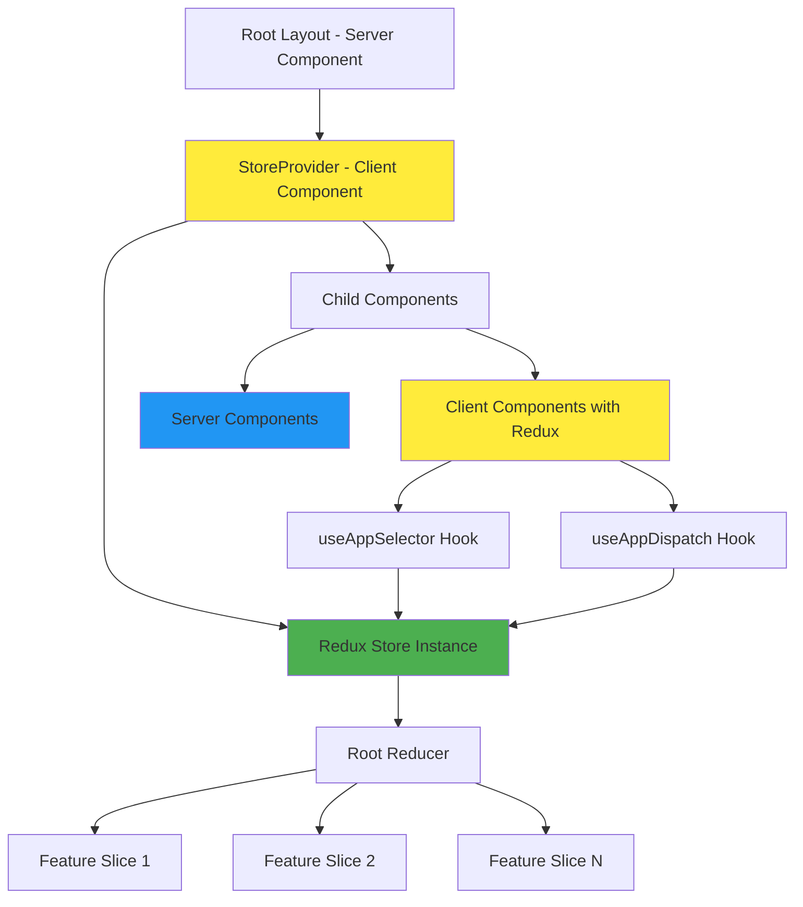
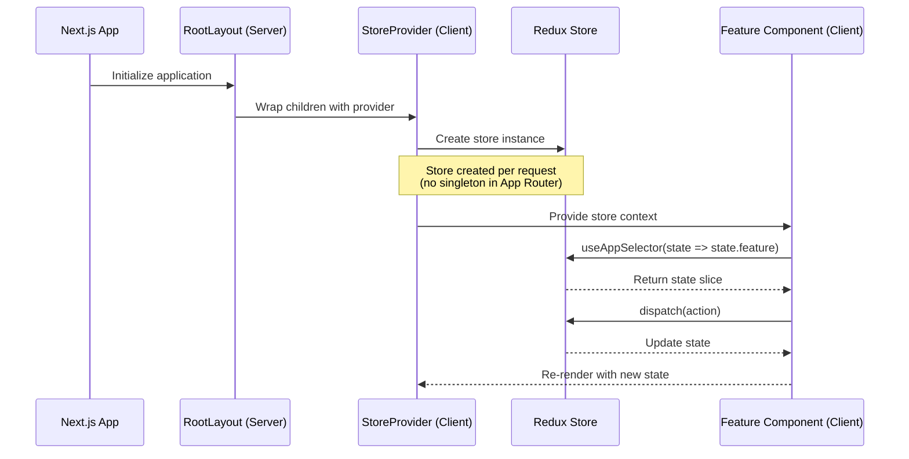

# Design Document: Redux Setup

## Overview

This design establishes a generic, reusable Redux Toolkit setup for a Next.js 16 App Router project. The architecture follows Next.js 16's server/client component model, where Redux state management is isolated to client components using the `'use client'` directive. The design provides a centralized store configuration, a provider wrapper for the component tree, and a pattern for creating feature slices with TypeScript support. The setup is framework-agnostic within the Redux ecosystem, allowing easy integration of any Redux middleware or enhancers while maintaining compatibility with React Server Components.

## Architecture



**Legend:**
- Yellow: Client Components (require `'use client'`)
- Green: Redux Store
- Blue: Server Components

## Main Workflow



## Components and Interfaces

### Component 1: Redux Store Configuration

**Purpose**: Centralized store configuration with TypeScript types and middleware setup

**Interface**:
```typescript
interface StoreConfig {
  reducer: Reducer
  middleware?: Middleware[]
  devTools?: boolean
}

interface AppStore extends Store {
  dispatch: AppDispatch
  getState: () => RootState
}

function makeStore(): AppStore
function setupStore(preloadedState?: PreloadedState<RootState>): AppStore
```

**Responsibilities**:
- Configure root reducer combining all feature slices
- Set up Redux DevTools integration
- Export TypeScript types for state and dispatch
- Provide store factory function for provider

### Component 2: Store Provider

**Purpose**: Client component wrapper that provides Redux store to the component tree

**Interface**:
```typescript
interface StoreProviderProps {
  children: React.ReactNode
}

function StoreProvider({ children }: StoreProviderProps): JSX.Element
```

**Responsibilities**:
- Create store instance using `useRef` to ensure single instance per render tree
- Wrap children with Redux Provider
- Mark as client component with `'use client'` directive
- Integrate with Next.js App Router layout

### Component 3: Typed Redux Hooks

**Purpose**: Pre-typed hooks for accessing Redux state and dispatch with TypeScript inference

**Interface**:
```typescript
function useAppDispatch(): AppDispatch
function useAppSelector<TSelected>(
  selector: (state: RootState) => TSelected,
  equalityFn?: (left: TSelected, right: TSelected) => boolean
): TSelected
function useAppStore(): AppStore
```

**Responsibilities**:
- Provide type-safe dispatch hook
- Provide type-safe selector hook with automatic state inference
- Provide direct store access when needed
- Replace generic Redux hooks with typed versions

### Component 4: Feature Slice Template

**Purpose**: Reusable pattern for creating feature-specific state slices

**Interface**:
```typescript
interface FeatureState {
  data: any[]
  loading: boolean
  error: string | null
}

interface FeatureSlice {
  name: string
  initialState: FeatureState
  reducers: Record<string, CaseReducer>
  extraReducers?: (builder: ActionReducerMapBuilder) => void
}

function createFeatureSlice(config: FeatureSlice): Slice
```

**Responsibilities**:
- Define slice state shape
- Implement synchronous reducers
- Implement async thunks for side effects
- Export actions and selectors
- Follow Redux Toolkit best practices

## Data Models

### Model 1: RootState

```typescript
interface RootState {
  // Feature slices
  [key: string]: any
  
  // Example feature slices:
  counter: CounterState
  user: UserState
  // ... additional slices
}
```

**Validation Rules**:
- Each slice must have a unique key
- Slice state must be serializable
- No functions or class instances in state

### Model 2: Feature Slice State

```typescript
interface FeatureSliceState<T = any> {
  data: T | T[] | null
  loading: boolean
  error: string | null
  lastUpdated?: number
}
```

**Validation Rules**:
- `data` must be serializable JSON
- `loading` indicates async operation status
- `error` contains error message or null
- `lastUpdated` is optional timestamp

### Model 3: Store Configuration

```typescript
interface StoreConfiguration {
  reducer: {
    [K in keyof RootState]: Reducer<RootState[K]>
  }
  middleware: (getDefaultMiddleware: GetDefaultMiddleware) => Middleware[]
  devTools: boolean | DevToolsOptions
}
```

**Validation Rules**:
- All reducers must be pure functions
- Middleware must not mutate state
- DevTools enabled only in development

## Key Functions with Formal Specifications

### Function 1: makeStore()

```typescript
function makeStore(): AppStore
```

**Preconditions:**
- Redux Toolkit must be installed
- All feature slices must be properly defined
- Root reducer must combine all slices

**Postconditions:**
- Returns configured Redux store instance
- Store has all middleware applied
- DevTools integration is active in development
- Store is ready to accept actions

**Loop Invariants:** N/A (no loops in function)

### Function 2: StoreProvider Component

```typescript
function StoreProvider({ children }: StoreProviderProps): JSX.Element
```

**Preconditions:**
- `children` is valid React node
- Component is used in client-side context
- `makeStore` function is available

**Postconditions:**
- Store instance created exactly once per component mount
- Redux Provider wraps all children
- Store context available to all descendant components
- No memory leaks on unmount

**Loop Invariants:** N/A (no loops in component)

### Function 3: useAppSelector Hook

```typescript
function useAppSelector<TSelected>(
  selector: (state: RootState) => TSelected,
  equalityFn?: (left: TSelected, right: TSelected) => boolean
): TSelected
```

**Preconditions:**
- Component using hook is within StoreProvider
- `selector` is a pure function
- `selector` returns serializable value

**Postconditions:**
- Returns selected state slice with correct TypeScript type
- Component re-renders only when selected state changes
- Equality function used if provided
- No stale closures

**Loop Invariants:** N/A (hook manages subscriptions internally)

### Function 4: createAppSlice (Slice Factory)

```typescript
function createAppSlice<T>(config: {
  name: string
  initialState: T
  reducers: Record<string, CaseReducer<T>>
}): Slice<T>
```

**Preconditions:**
- `name` is unique across all slices
- `initialState` is serializable
- All reducers are pure functions
- Reducers do not mutate state directly

**Postconditions:**
- Returns slice with actions and reducer
- Actions are automatically typed
- Reducer handles all defined actions
- Slice can be added to store configuration

**Loop Invariants:** N/A (no loops in function)

## Algorithmic Pseudocode

### Store Initialization Algorithm

```typescript
ALGORITHM initializeReduxStore()
INPUT: None
OUTPUT: store of type AppStore

BEGIN
  // Step 1: Combine all feature reducers
  rootReducer ← combineReducers({
    feature1: feature1Reducer,
    feature2: feature2Reducer,
    // ... additional reducers
  })
  
  ASSERT rootReducer is valid reducer function
  
  // Step 2: Configure middleware
  middleware ← getDefaultMiddleware({
    serializableCheck: {
      ignoredActions: ['persist/PERSIST'],
    },
  })
  
  ASSERT all middleware are valid functions
  
  // Step 3: Create store with configuration
  store ← configureStore({
    reducer: rootReducer,
    middleware: middleware,
    devTools: process.env.NODE_ENV !== 'production',
  })
  
  ASSERT store.getState() returns valid RootState
  ASSERT store.dispatch is function
  
  RETURN store
END
```

**Preconditions:**
- All feature reducers are defined and exported
- Redux Toolkit is properly installed
- Environment variables are accessible

**Postconditions:**
- Store is fully configured and operational
- All middleware are applied in correct order
- DevTools integration is active in development
- Store can dispatch actions and update state

**Loop Invariants:** N/A (no loops in algorithm)

### Provider Mounting Algorithm

```typescript
ALGORITHM mountStoreProvider(children: ReactNode)
INPUT: children (React component tree)
OUTPUT: JSX element with Redux context

BEGIN
  // Step 1: Create store reference (once per component lifetime)
  IF storeRef.current is null THEN
    storeRef.current ← makeStore()
    ASSERT storeRef.current is valid AppStore
  END IF
  
  // Step 2: Wrap children with Redux Provider
  providerElement ← <Provider store={storeRef.current}>
    {children}
  </Provider>
  
  ASSERT providerElement is valid JSX
  
  // Step 3: Return provider element
  RETURN providerElement
END
```

**Preconditions:**
- Component is marked with `'use client'` directive
- `makeStore` function is available
- `children` prop is provided

**Postconditions:**
- Store created exactly once per component instance
- All children have access to Redux store
- Store persists across re-renders
- Store is properly cleaned up on unmount

**Loop Invariants:** N/A (no loops in algorithm)

### State Selection Algorithm

```typescript
ALGORITHM selectStateSlice(selector: Function, equalityFn?: Function)
INPUT: selector function, optional equality function
OUTPUT: selected state value

BEGIN
  // Step 1: Get current store state
  currentState ← store.getState()
  ASSERT currentState is valid RootState
  
  // Step 2: Apply selector to state
  selectedValue ← selector(currentState)
  
  // Step 3: Check if re-render needed
  IF equalityFn is provided THEN
    shouldUpdate ← NOT equalityFn(previousValue, selectedValue)
  ELSE
    shouldUpdate ← previousValue !== selectedValue
  END IF
  
  // Step 4: Update component if needed
  IF shouldUpdate THEN
    triggerRerender()
    previousValue ← selectedValue
  END IF
  
  RETURN selectedValue
END
```

**Preconditions:**
- Component is within StoreProvider
- Selector is pure function
- Store state is valid

**Postconditions:**
- Returns correctly typed state slice
- Component re-renders only on relevant state changes
- No unnecessary re-renders
- Selector memoization works correctly

**Loop Invariants:** N/A (hook manages subscription lifecycle)

### Async Thunk Execution Algorithm

```typescript
ALGORITHM executeAsyncThunk(thunkAction: AsyncThunk, payload: any)
INPUT: async thunk action creator, payload data
OUTPUT: Promise with action result

BEGIN
  // Step 1: Dispatch pending action
  dispatch(thunkAction.pending(requestId, payload))
  ASSERT store.getState().loading === true
  
  // Step 2: Execute async operation
  TRY
    result ← AWAIT asyncOperation(payload)
    ASSERT result is serializable
    
    // Step 3: Dispatch fulfilled action
    dispatch(thunkAction.fulfilled(result, requestId, payload))
    ASSERT store.getState().loading === false
    ASSERT store.getState().data === result
    
    RETURN result
    
  CATCH error
    // Step 4: Dispatch rejected action
    dispatch(thunkAction.rejected(error, requestId, payload))
    ASSERT store.getState().loading === false
    ASSERT store.getState().error === error.message
    
    THROW error
  END TRY
END
```

**Preconditions:**
- Thunk is created with `createAsyncThunk`
- Payload is serializable
- Async operation is properly defined
- Network/API is accessible (for API calls)

**Postconditions:**
- Loading state updated correctly throughout lifecycle
- Success: data stored in state, loading false, error null
- Failure: error stored in state, loading false, data unchanged
- All state transitions are atomic

**Loop Invariants:** N/A (async state machine)

## Example Usage

### Example 1: Store Configuration

```typescript
// src/lib/redux/store.ts
import { configureStore } from '@reduxjs/toolkit'
import counterReducer from './features/counter/counterSlice'
import userReducer from './features/user/userSlice'

export const makeStore = () => {
  return configureStore({
    reducer: {
      counter: counterReducer,
      user: userReducer,
    },
    middleware: (getDefaultMiddleware) =>
      getDefaultMiddleware({
        serializableCheck: {
          ignoredActions: ['persist/PERSIST'],
        },
      }),
    devTools: process.env.NODE_ENV !== 'production',
  })
}

export type AppStore = ReturnType<typeof makeStore>
export type RootState = ReturnType<AppStore['getState']>
export type AppDispatch = AppStore['dispatch']
```

### Example 2: Store Provider Setup

```typescript
// src/lib/redux/StoreProvider.tsx
'use client'

import { useRef } from 'react'
import { Provider } from 'react-redux'
import { makeStore, AppStore } from './store'

export default function StoreProvider({
  children,
}: {
  children: React.ReactNode
}) {
  const storeRef = useRef<AppStore>()
  
  if (!storeRef.current) {
    storeRef.current = makeStore()
  }

  return <Provider store={storeRef.current}>{children}</Provider>
}
```

### Example 3: Typed Hooks

```typescript
// src/lib/redux/hooks.ts
import { useDispatch, useSelector, useStore } from 'react-redux'
import type { RootState, AppDispatch, AppStore } from './store'

export const useAppDispatch = useDispatch.withTypes<AppDispatch>()
export const useAppSelector = useSelector.withTypes<RootState>()
export const useAppStore = useStore.withTypes<AppStore>()
```

### Example 4: Feature Slice

```typescript
// src/lib/redux/features/counter/counterSlice.ts
import { createSlice, PayloadAction } from '@reduxjs/toolkit'

interface CounterState {
  value: number
  status: 'idle' | 'loading'
}

const initialState: CounterState = {
  value: 0,
  status: 'idle',
}

export const counterSlice = createSlice({
  name: 'counter',
  initialState,
  reducers: {
    increment: (state) => {
      state.value += 1
    },
    decrement: (state) => {
      state.value -= 1
    },
    incrementByAmount: (state, action: PayloadAction<number>) => {
      state.value += action.payload
    },
    reset: (state) => {
      state.value = 0
    },
  },
})

export const { increment, decrement, incrementByAmount, reset } = counterSlice.actions
export default counterSlice.reducer
```

### Example 5: Async Thunk

```typescript
// src/lib/redux/features/user/userSlice.ts
import { createSlice, createAsyncThunk } from '@reduxjs/toolkit'

interface User {
  id: string
  name: string
  email: string
}

interface UserState {
  data: User | null
  loading: boolean
  error: string | null
}

const initialState: UserState = {
  data: null,
  loading: false,
  error: null,
}

export const fetchUser = createAsyncThunk(
  'user/fetchUser',
  async (userId: string) => {
    const response = await fetch(`/api/users/${userId}`)
    if (!response.ok) throw new Error('Failed to fetch user')
    return response.json()
  }
)

export const userSlice = createSlice({
  name: 'user',
  initialState,
  reducers: {
    clearUser: (state) => {
      state.data = null
      state.error = null
    },
  },
  extraReducers: (builder) => {
    builder
      .addCase(fetchUser.pending, (state) => {
        state.loading = true
        state.error = null
      })
      .addCase(fetchUser.fulfilled, (state, action) => {
        state.loading = false
        state.data = action.payload
      })
      .addCase(fetchUser.rejected, (state, action) => {
        state.loading = false
        state.error = action.error.message || 'Failed to fetch user'
      })
  },
})

export const { clearUser } = userSlice.actions
export default userSlice.reducer
```

### Example 6: Using Redux in Client Component

```typescript
// src/app/components/Counter.tsx
'use client'

import { useAppSelector, useAppDispatch } from '@/lib/redux/hooks'
import { increment, decrement, incrementByAmount } from '@/lib/redux/features/counter/counterSlice'

export default function Counter() {
  const count = useAppSelector((state) => state.counter.value)
  const dispatch = useAppDispatch()

  return (
    <div>
      <h2>Count: {count}</h2>
      <button onClick={() => dispatch(increment())}>Increment</button>
      <button onClick={() => dispatch(decrement())}>Decrement</button>
      <button onClick={() => dispatch(incrementByAmount(5))}>Add 5</button>
    </div>
  )
}
```

### Example 7: Integration with Root Layout

```typescript
// src/app/layout.tsx
import type { Metadata } from 'next'
import StoreProvider from '@/lib/redux/StoreProvider'
import './globals.css'

export const metadata: Metadata = {
  title: 'Redux Next.js App',
  description: 'Next.js with Redux Toolkit',
}

export default function RootLayout({
  children,
}: {
  children: React.ReactNode
}) {
  return (
    <html lang="en">
      <body>
        <StoreProvider>{children}</StoreProvider>
      </body>
    </html>
  )
}
```

## Correctness Properties

### Property 1: Store Singleton Per Request
```typescript
∀ render_tree ∈ ComponentTree:
  StoreProvider.storeRef.current === StoreProvider.storeRef.current
  ∧ store_instance_count = 1
```
**Meaning**: Each render tree has exactly one store instance that persists across re-renders.

### Property 2: State Serializability
```typescript
∀ state ∈ RootState:
  JSON.parse(JSON.stringify(state)) === state
```
**Meaning**: All state must be serializable to JSON (no functions, class instances, or circular references).

### Property 3: Reducer Purity
```typescript
∀ reducer ∈ Reducers, ∀ state ∈ State, ∀ action ∈ Actions:
  reducer(state, action) produces new_state
  ∧ state remains unchanged (immutability)
```
**Meaning**: Reducers must be pure functions that never mutate the original state.

### Property 4: Action Type Uniqueness
```typescript
∀ slice1, slice2 ∈ Slices where slice1 ≠ slice2:
  slice1.actions.type ∩ slice2.actions.type = ∅
```
**Meaning**: Action types must be unique across all slices to prevent conflicts.

### Property 5: Selector Consistency
```typescript
∀ selector ∈ Selectors, ∀ state ∈ RootState:
  selector(state) === selector(state) (referential transparency)
```
**Meaning**: Selectors must be pure functions that return consistent results for the same state.

### Property 6: Async Thunk State Transitions
```typescript
∀ thunk ∈ AsyncThunks:
  initial_state.loading = false
  → pending_state.loading = true
  → (fulfilled_state.loading = false ∧ fulfilled_state.error = null)
     ∨ (rejected_state.loading = false ∧ rejected_state.error ≠ null)
```
**Meaning**: Async thunks follow a predictable state machine: idle → loading → success/error.

### Property 7: Type Safety
```typescript
∀ dispatch_call ∈ DispatchCalls:
  TypeScript.typeCheck(dispatch_call) = valid
  ∧ action.payload matches expected type
```
**Meaning**: All dispatch calls and state selections are type-checked at compile time.

### Property 8: Client Component Boundary
```typescript
∀ component ∈ ReduxComponents:
  component.uses(useAppSelector ∨ useAppDispatch)
  → component.directive = 'use client'
```
**Meaning**: Any component using Redux hooks must be a client component.

## Error Handling

### Error Scenario 1: Store Provider Missing

**Condition**: Component tries to use Redux hooks outside StoreProvider
**Response**: React throws error: "could not find react-redux context value"
**Recovery**: Ensure StoreProvider wraps the component tree in root layout

### Error Scenario 2: Non-Serializable State

**Condition**: Reducer attempts to store function or class instance in state
**Response**: Redux middleware logs warning in development, potential hydration errors
**Recovery**: Use serializable data only; store IDs and reconstruct objects as needed

### Error Scenario 3: Async Thunk Rejection

**Condition**: API call fails or network error occurs
**Response**: Thunk dispatches rejected action with error message
**Recovery**: Display error to user, provide retry mechanism, log error for monitoring

### Error Scenario 4: Selector Performance Issue

**Condition**: Selector creates new object/array reference on every call
**Response**: Component re-renders unnecessarily on every state change
**Recovery**: Use `createSelector` from Reselect for memoization, or use equality function

### Error Scenario 5: Server Component Redux Usage

**Condition**: Attempt to use Redux hooks in server component
**Response**: Build error or runtime error about hooks in server context
**Recovery**: Move Redux logic to client component, pass data as props from server

## Testing Strategy

### Unit Testing Approach

**Reducers:**
- Test each reducer with various actions
- Verify state immutability
- Test initial state
- Test edge cases (empty arrays, null values)

**Selectors:**
- Test selector output for various state shapes
- Verify memoization behavior
- Test with empty/null state

**Async Thunks:**
- Mock API calls
- Test pending/fulfilled/rejected states
- Verify error handling
- Test with various response types

**Example Test:**
```typescript
describe('counterSlice', () => {
  it('should increment value', () => {
    const previousState = { value: 0, status: 'idle' }
    expect(counterReducer(previousState, increment())).toEqual({
      value: 1,
      status: 'idle',
    })
  })
})
```

### Property-Based Testing Approach

**Property Test Library**: fast-check

**Properties to Test:**
1. **Reducer Idempotence**: Applying same action twice produces consistent results
2. **State Serializability**: Any state can be serialized and deserialized
3. **Action Ordering**: Different action orders produce valid states
4. **Selector Purity**: Same state input always produces same output

**Example Property Test:**
```typescript
import fc from 'fast-check'

test('reducer maintains state serializability', () => {
  fc.assert(
    fc.property(
      fc.record({ value: fc.integer(), status: fc.constantFrom('idle', 'loading') }),
      fc.oneof(increment(), decrement(), reset()),
      (state, action) => {
        const newState = counterReducer(state, action)
        const serialized = JSON.stringify(newState)
        const deserialized = JSON.parse(serialized)
        expect(deserialized).toEqual(newState)
      }
    )
  )
})
```

### Integration Testing Approach

**Component Integration:**
- Render components with test store
- Dispatch actions and verify UI updates
- Test async thunk integration
- Verify provider context propagation

**Example Integration Test:**
```typescript
import { render, screen } from '@testing-library/react'
import { Provider } from 'react-redux'
import { makeStore } from '@/lib/redux/store'
import Counter from '@/app/components/Counter'

test('counter increments on button click', async () => {
  const store = makeStore()
  render(
    <Provider store={store}>
      <Counter />
    </Provider>
  )
  
  const button = screen.getByText('Increment')
  await userEvent.click(button)
  
  expect(screen.getByText('Count: 1')).toBeInTheDocument()
})
```

## Performance Considerations

**Selector Memoization:**
- Use `createSelector` from Reselect for derived state
- Avoid creating new objects/arrays in selectors
- Use shallow equality checks when appropriate

**Code Splitting:**
- Lazy load feature slices when possible
- Use dynamic imports for large reducers
- Split store configuration by route

**Re-render Optimization:**
- Select minimal state needed in components
- Use equality functions in useAppSelector
- Avoid selecting entire state object

**Bundle Size:**
- Redux Toolkit includes Immer and Reselect
- Tree-shaking removes unused code
- Consider Redux Toolkit Query for API caching

## Security Considerations

**State Exposure:**
- Never store sensitive data (passwords, tokens) in Redux state
- Redux DevTools exposes all state in development
- State is visible in React DevTools

**XSS Prevention:**
- Sanitize user input before storing in state
- Validate data from API responses
- Use TypeScript for type safety

**API Keys:**
- Never store API keys in Redux state
- Use environment variables for secrets
- Keep sensitive operations on server side

## Dependencies

**Required:**
- `@reduxjs/toolkit` (^2.0.0): Core Redux Toolkit library
- `react-redux` (^9.0.0): React bindings for Redux
- `react` (^19.0.0): React library
- `next` (^16.0.0): Next.js framework

**Optional:**
- `reselect` (included in Redux Toolkit): Memoized selectors
- `redux-persist` (^6.0.0): Persist state to localStorage
- `@reduxjs/toolkit/query`: API caching and data fetching

**Development:**
- `@types/react-redux` (^7.1.0): TypeScript types
- `fast-check` (^3.0.0): Property-based testing
- `@testing-library/react` (^14.0.0): Component testing
