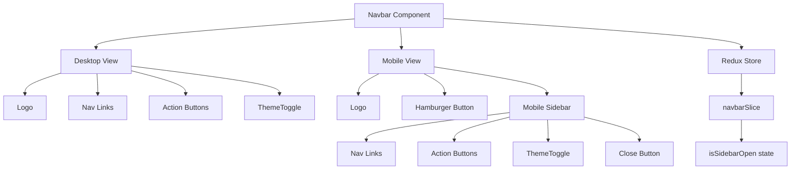
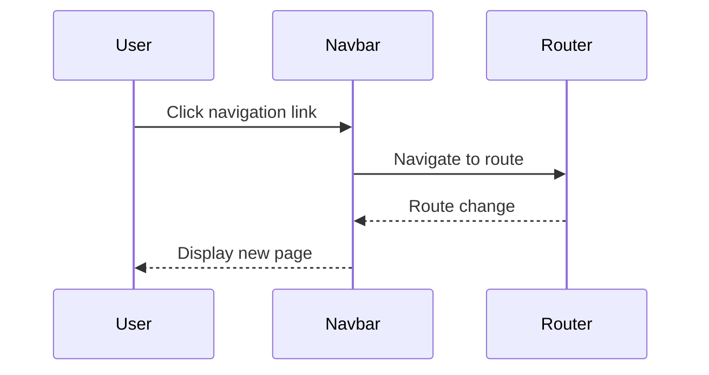
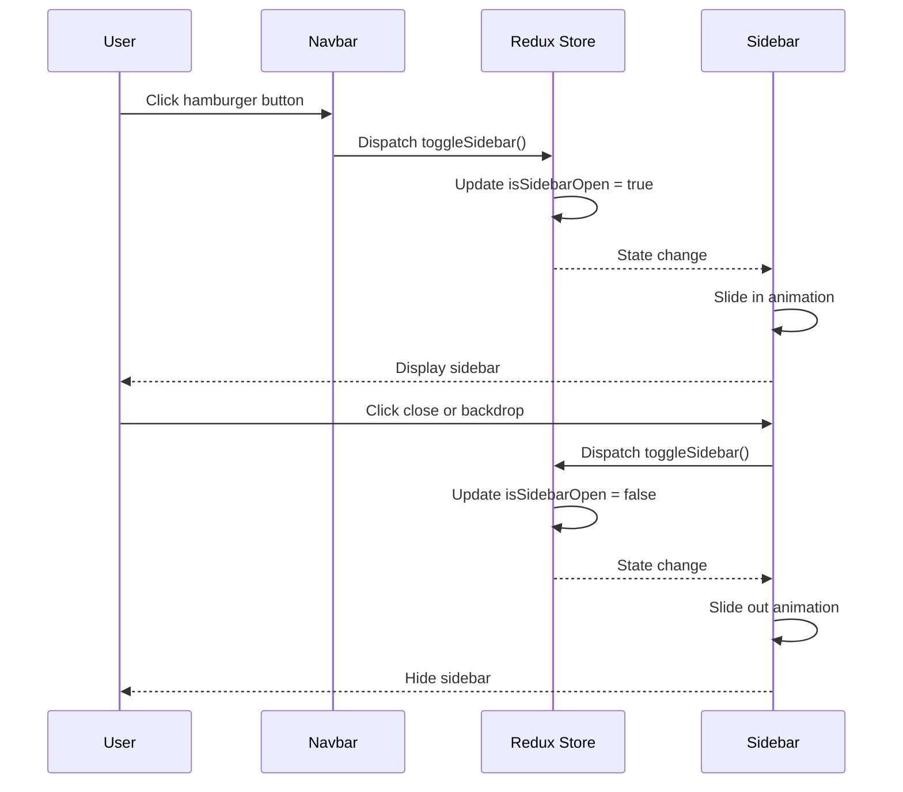

# Design Document: Responsive Navbar

## Overview

The responsive navbar is a navigation component that adapts to different screen sizes. On desktop devices (≥768px), it displays as a horizontal navigation bar with inline menu items. On mobile devices (<768px), it transforms into a compact header with a hamburger menu button that opens a sidebar sliding in from the right. The component integrates with the existing Redux store for state management (sidebar open/close), next-themes for theme switching, and Tailwind CSS for styling with smooth animations.

## Architecture



## Sequence Diagrams

### Desktop Navigation Flow



### Mobile Sidebar Flow



## Components and Interfaces

### Component 1: Navbar

**Purpose**: Main navigation component that renders different layouts based on screen size

**Interface**:
```typescript
interface NavbarProps {
  className?: string
}

interface NavLink {
  label: string
  href: string
}

const NAV_LINKS: NavLink[] = [
  { label: 'Performance', href: '/performance' },
  { label: 'Strategies', href: '/strategies' },
  { label: 'Transparency', href: '/transparency' }
]
```

**Responsibilities**:
- Render logo/brand section
- Display navigation links (desktop inline, mobile in sidebar)
- Render action buttons (Sign in, Open dashboard)
- Integrate ThemeToggle component
- Show/hide mobile menu toggle button based on screen size
- Manage responsive breakpoints

### Component 2: MobileSidebar

**Purpose**: Sidebar overlay that slides in from the right on mobile devices

**Interface**:
```typescript
interface MobileSidebarProps {
  isOpen: boolean
  onClose: () => void
  navLinks: NavLink[]
}
```

**Responsibilities**:
- Render backdrop overlay with click-to-close
- Slide in/out animation from right side
- Display navigation links vertically
- Render action buttons
- Include close button (X icon)
- Integrate ThemeToggle component
- Prevent body scroll when open

### Component 3: HamburgerButton

**Purpose**: Toggle button for mobile sidebar

**Interface**:
```typescript
interface HamburgerButtonProps {
  isOpen: boolean
  onClick: () => void
  className?: string
}
```

**Responsibilities**:
- Display hamburger icon (three horizontal lines)
- Animate to X icon when sidebar is open
- Handle click events to toggle sidebar
- Provide accessible aria-label

## Data Models

### Redux State: navbarSlice

```typescript
interface NavbarState {
  isSidebarOpen: boolean
}

const initialState: NavbarState = {
  isSidebarOpen: false
}
```

**Validation Rules**:
- `isSidebarOpen` must be a boolean value
- State should reset to `false` on route changes (optional enhancement)

### Navigation Link Model

```typescript
interface NavLink {
  label: string  // Display text for the link
  href: string   // Route path
}
```

**Validation Rules**:
- `label` must be non-empty string
- `href` must be valid route path starting with '/'

## Key Functions with Formal Specifications

### Function 1: toggleSidebar()

```typescript
function toggleSidebar(): void
```

**Preconditions:**
- Redux store is initialized and accessible
- navbarSlice is registered in the store

**Postconditions:**
- `isSidebarOpen` state is toggled (true → false, false → true)
- Component re-renders with new state
- Sidebar animation is triggered

**Loop Invariants:** N/A

### Function 2: closeSidebar()

```typescript
function closeSidebar(): void
```

**Preconditions:**
- Redux store is initialized and accessible
- navbarSlice is registered in the store

**Postconditions:**
- `isSidebarOpen` state is set to `false`
- Sidebar slide-out animation is triggered
- Body scroll is re-enabled

**Loop Invariants:** N/A

### Function 3: handleBackdropClick()

```typescript
function handleBackdropClick(event: React.MouseEvent): void
```

**Preconditions:**
- Event target is the backdrop element (not a child)
- Sidebar is currently open (`isSidebarOpen === true`)

**Postconditions:**
- If click is on backdrop (not sidebar content), `closeSidebar()` is called
- Click events on sidebar content do not close the sidebar

**Loop Invariants:** N/A

## Algorithmic Pseudocode

### Main Navbar Rendering Algorithm

```pascal
ALGORITHM renderNavbar()
INPUT: None
OUTPUT: JSX.Element (rendered navbar)

BEGIN
  // Get sidebar state from Redux
  isSidebarOpen ← useAppSelector(state.navbar.isSidebarOpen)
  dispatch ← useAppDispatch()
  
  // Define toggle handler
  PROCEDURE handleToggle()
    dispatch(toggleSidebar())
  END PROCEDURE
  
  // Render desktop navbar (visible on md: breakpoint and above)
  desktopNav ← CREATE_ELEMENT(
    CONTAINER with flex layout,
    CHILDREN: [
      Logo,
      NavigationLinks (horizontal),
      ActionButtons,
      ThemeToggle
    ]
  )
  
  // Render mobile header (visible below md: breakpoint)
  mobileHeader ← CREATE_ELEMENT(
    CONTAINER with flex layout,
    CHILDREN: [
      Logo,
      HamburgerButton(isOpen: isSidebarOpen, onClick: handleToggle)
    ]
  )
  
  // Render mobile sidebar
  mobileSidebar ← CREATE_ELEMENT(
    MobileSidebar,
    PROPS: {
      isOpen: isSidebarOpen,
      onClose: handleToggle,
      navLinks: NAV_LINKS
    }
  )
  
  // Return combined structure
  RETURN (
    <nav>
      {desktopNav}  // Hidden on mobile
      {mobileHeader}  // Hidden on desktop
      {mobileSidebar}  // Conditionally rendered
    </nav>
  )
END
```

**Preconditions:**
- Redux store is properly configured with navbarSlice
- Tailwind CSS responsive classes are available
- ThemeToggle component is accessible

**Postconditions:**
- Navbar renders with appropriate layout for current screen size
- All interactive elements have proper event handlers
- Sidebar state is synchronized with Redux store

### Mobile Sidebar Animation Algorithm

```pascal
ALGORITHM animateSidebar(isOpen)
INPUT: isOpen of type boolean
OUTPUT: CSS classes for animation

BEGIN
  // Base classes for sidebar
  baseClasses ← "fixed top-0 right-0 h-full w-64 bg-card shadow-lg transform transition-transform duration-300 ease-in-out z-50"
  
  // Conditional transform based on open state
  IF isOpen = true THEN
    transformClass ← "translate-x-0"  // Visible position
  ELSE
    transformClass ← "translate-x-full"  // Hidden off-screen
  END IF
  
  // Combine classes
  finalClasses ← baseClasses + " " + transformClass
  
  RETURN finalClasses
END
```

**Preconditions:**
- `isOpen` is a valid boolean value
- Tailwind CSS transform and transition utilities are available

**Postconditions:**
- Returns string of CSS classes for sidebar animation
- Sidebar slides in when `isOpen` is true
- Sidebar slides out when `isOpen` is false

### Body Scroll Lock Algorithm

```pascal
ALGORITHM manageBodyScroll(isSidebarOpen)
INPUT: isSidebarOpen of type boolean
OUTPUT: Side effect on document.body

BEGIN
  // Use effect hook to manage scroll lock
  EFFECT_HOOK(
    DEPENDENCIES: [isSidebarOpen],
    
    PROCEDURE effect()
      IF isSidebarOpen = true THEN
        // Prevent body scroll
        document.body.style.overflow ← "hidden"
      ELSE
        // Restore body scroll
        document.body.style.overflow ← ""
      END IF
      
      // Cleanup function
      RETURN PROCEDURE cleanup()
        document.body.style.overflow ← ""
      END PROCEDURE
    END PROCEDURE
  )
END
```

**Preconditions:**
- Component is mounted in browser environment
- `document.body` is accessible

**Postconditions:**
- Body scroll is disabled when sidebar is open
- Body scroll is restored when sidebar is closed
- Cleanup restores scroll on component unmount

## Example Usage

### Example 1: Basic Navbar Integration in Layout

```typescript
// src/app/layout.tsx
import { Navbar } from '@/components/Navbar'

export default function RootLayout({ children }: { children: React.ReactNode }) {
  return (
    <html lang="en">
      <body>
        <ThemeProvider>
          <StoreProvider>
            <Navbar />
            <main>{children}</main>
          </StoreProvider>
        </ThemeProvider>
      </body>
    </html>
  )
}
```

### Example 2: Redux Slice Setup

```typescript
// src/lib/redux/features/navbar/navbarSlice.ts
import { createSlice } from '@reduxjs/toolkit'

interface NavbarState {
  isSidebarOpen: boolean
}

const initialState: NavbarState = {
  isSidebarOpen: false
}

const navbarSlice = createSlice({
  name: 'navbar',
  initialState,
  reducers: {
    toggleSidebar: (state) => {
      state.isSidebarOpen = !state.isSidebarOpen
    },
    closeSidebar: (state) => {
      state.isSidebarOpen = false
    }
  }
})

export const { toggleSidebar, closeSidebar } = navbarSlice.actions
export default navbarSlice.reducer
```

### Example 3: Navbar Component Implementation

```typescript
// src/components/Navbar.tsx
'use client'

import Link from 'next/link'
import { useAppSelector, useAppDispatch } from '@/lib/redux/hooks'
import { toggleSidebar } from '@/lib/redux/features/navbar/navbarSlice'
import { ThemeToggle } from './ThemeToggle'
import { MobileSidebar } from './MobileSidebar'
import { HamburgerButton } from './HamburgerButton'

const NAV_LINKS = [
  { label: 'Performance', href: '/performance' },
  { label: 'Strategies', href: '/strategies' },
  { label: 'Transparency', href: '/transparency' }
]

export function Navbar() {
  const isSidebarOpen = useAppSelector((state) => state.navbar.isSidebarOpen)
  const dispatch = useAppDispatch()

  const handleToggle = () => {
    dispatch(toggleSidebar())
  }

  return (
    <>
      <nav className="sticky top-0 z-40 w-full border-b border-border bg-background/95 backdrop-blur supports-[backdrop-filter]:bg-background/60">
        {/* Desktop Navbar */}
        <div className="hidden md:flex container mx-auto px-4 h-16 items-center justify-between">
          <div className="flex items-center gap-8">
            <Link href="/" className="text-xl font-bold text-foreground">
              Brand
            </Link>
            <div className="flex gap-6">
              {NAV_LINKS.map((link) => (
                <Link
                  key={link.href}
                  href={link.href}
                  className="text-sm font-medium text-muted-foreground hover:text-foreground transition-colors"
                >
                  {link.label}
                </Link>
              ))}
            </div>
          </div>
          <div className="flex items-center gap-4">
            <button className="text-sm font-medium text-muted-foreground hover:text-foreground transition-colors">
              Sign in
            </button>
            <button className="px-4 py-2 text-sm font-medium rounded-lg bg-primary text-primary-foreground hover:bg-primary/90 transition-colors">
              Open dashboard
            </button>
            <ThemeToggle />
          </div>
        </div>

        {/* Mobile Header */}
        <div className="flex md:hidden container mx-auto px-4 h-16 items-center justify-between">
          <Link href="/" className="text-xl font-bold text-foreground">
            Brand
          </Link>
          <div className="flex items-center gap-2">
            <ThemeToggle />
            <HamburgerButton isOpen={isSidebarOpen} onClick={handleToggle} />
          </div>
        </div>
      </nav>

      {/* Mobile Sidebar */}
      <MobileSidebar
        isOpen={isSidebarOpen}
        onClose={handleToggle}
        navLinks={NAV_LINKS}
      />
    </>
  )
}
```

## Correctness Properties

### Property 1: Sidebar State Consistency
```typescript
// For all state transitions, sidebar open state must be boolean
∀ state ∈ ReduxState: typeof state.navbar.isSidebarOpen === 'boolean'
```

### Property 2: Responsive Breakpoint Behavior
```typescript
// Desktop view shows inline navigation, mobile view shows hamburger
∀ screenWidth ∈ Number:
  (screenWidth >= 768) ⟹ (desktopNav.visible ∧ ¬hamburgerButton.visible) ∧
  (screenWidth < 768) ⟹ (¬desktopNav.visible ∧ hamburgerButton.visible)
```

### Property 3: Sidebar Animation Timing
```typescript
// Sidebar transition completes within 300ms
∀ toggleEvent ∈ SidebarToggleEvent:
  animationDuration(toggleEvent) === 300ms
```

### Property 4: Body Scroll Lock
```typescript
// Body scroll is locked when sidebar is open on mobile
∀ state ∈ ReduxState:
  (state.navbar.isSidebarOpen ∧ isMobile) ⟹ document.body.style.overflow === 'hidden'
```

### Property 5: Navigation Link Accessibility
```typescript
// All navigation links are keyboard accessible
∀ link ∈ NAV_LINKS:
  link.element.tabIndex >= 0 ∧ link.element.hasAttribute('href')
```

## Error Handling

### Error Scenario 1: Redux Store Not Initialized

**Condition**: Component tries to access Redux state before store is ready
**Response**: Component should be wrapped in StoreProvider; throw descriptive error if not
**Recovery**: Ensure Navbar is rendered within StoreProvider in layout

### Error Scenario 2: Theme Toggle Not Available

**Condition**: ThemeToggle component fails to load or theme context is missing
**Response**: Render navbar without theme toggle, log warning to console
**Recovery**: Graceful degradation - navbar remains functional without theme switching

### Error Scenario 3: Invalid Navigation Link

**Condition**: NAV_LINKS contains invalid href or missing label
**Response**: Skip rendering invalid link, log error to console
**Recovery**: Filter out invalid links before rendering

### Error Scenario 4: Sidebar Animation Interrupted

**Condition**: User rapidly toggles sidebar before animation completes
**Response**: Cancel previous animation, start new animation from current position
**Recovery**: Tailwind CSS transitions handle this automatically

## Testing Strategy

### Unit Testing Approach

**Test Cases**:
1. Navbar renders with correct desktop layout on large screens
2. Navbar renders with correct mobile layout on small screens
3. HamburgerButton toggles sidebar state when clicked
4. MobileSidebar slides in when isOpen is true
5. MobileSidebar slides out when isOpen is false
6. Backdrop click closes sidebar
7. Navigation links render correctly
8. Action buttons render correctly
9. ThemeToggle is integrated and functional
10. Body scroll is locked when sidebar is open

**Coverage Goals**: 90%+ code coverage for all navbar components

### Property-Based Testing Approach

**Property Test Library**: fast-check (for TypeScript/JavaScript)

**Properties to Test**:
1. **Idempotent Toggle**: Toggling sidebar twice returns to original state
   ```typescript
   fc.assert(
     fc.property(fc.boolean(), (initialState) => {
       const state1 = toggleSidebar(initialState)
       const state2 = toggleSidebar(state1)
       return state2 === initialState
     })
   )
   ```

2. **State Consistency**: Sidebar state is always boolean
   ```typescript
   fc.assert(
     fc.property(fc.anything(), (action) => {
       const state = navbarReducer(undefined, action)
       return typeof state.isSidebarOpen === 'boolean'
     })
   )
   ```

3. **Animation Class Generation**: Generated classes are always valid strings
   ```typescript
   fc.assert(
     fc.property(fc.boolean(), (isOpen) => {
       const classes = getSidebarClasses(isOpen)
       return typeof classes === 'string' && classes.length > 0
     })
   )
   ```

### Integration Testing Approach

**Test Scenarios**:
1. Full navigation flow: Click hamburger → sidebar opens → click link → navigate → sidebar closes
2. Theme toggle integration: Toggle theme while sidebar is open
3. Responsive behavior: Resize window from desktop to mobile and verify layout changes
4. Redux integration: Verify state updates propagate correctly to all components

## Performance Considerations

1. **Lazy Loading**: Consider code-splitting MobileSidebar component to reduce initial bundle size
2. **Animation Performance**: Use CSS transforms (translate) instead of position changes for 60fps animations
3. **Memoization**: Memoize navigation links array to prevent unnecessary re-renders
4. **Event Listeners**: Use passive event listeners for scroll and touch events
5. **Backdrop Rendering**: Only render backdrop when sidebar is open to reduce DOM nodes

## Security Considerations

1. **XSS Prevention**: Sanitize any dynamic content in navigation links (though using static config)
2. **CSRF Protection**: Ensure action buttons (Sign in, Open dashboard) use proper authentication
3. **Clickjacking**: Navbar should not be vulnerable to clickjacking attacks (use CSP headers)
4. **Accessibility**: Ensure keyboard navigation works correctly to prevent accessibility-based attacks

## Dependencies

- **next**: ^16.2.4 (App Router, Link component)
- **react**: ^19.2.4 (Hooks: useState, useEffect)
- **react-redux**: ^9.2.0 (useSelector, useDispatch)
- **@reduxjs/toolkit**: ^2.11.2 (createSlice, configureStore)
- **next-themes**: ^0.4.6 (ThemeToggle integration)
- **tailwindcss**: ^4 (Styling, responsive utilities, animations)
- **@heroicons/react** or similar: For hamburger and close icons (to be installed)
