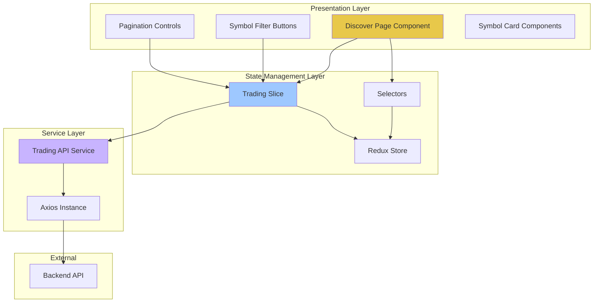

# Design Document: Trading Symbols API Integration

## Overview

This design document specifies the technical architecture for integrating real trading symbols data into the discover page. The implementation replaces mock data with live API data, introduces Redux-based state management for trading symbols and prices, and implements client-side pagination and filtering. The solution leverages the existing Axios configuration and follows established patterns in the codebase for Redux slices and API services.

### Goals

- Replace mock data dependencies with real API integration
- Implement centralized state management using Redux Toolkit
- Provide efficient pagination for large symbol lists
- Maintain existing UI/UX while enhancing with real data
- Ensure type safety across the entire data flow
- Optimize performance through selective data fetching and caching

### Non-Goals

- Real-time price updates via WebSocket (future enhancement)
- Server-side pagination (client-side pagination is sufficient for MVP)
- Advanced filtering beyond category-based filtering
- Historical price data visualization
- User preferences persistence for filters/pagination

## Architecture

### High-Level Architecture



### Data Flow

1. **Initial Load**: Discover page mounts → dispatches `fetchSymbols` thunk → Trading API Service calls symbols endpoint → Redux state updated with symbols array
2. **Price Fetching**: For each visible symbol → dispatches `fetchSymbolPrice` thunk → Trading API Service calls price endpoint → Redux state updated with price data
3. **Filtering**: User selects category → Redux action updates filter state → Selector recomputes filtered symbols → UI re-renders with filtered data
4. **Pagination**: User navigates pages → Redux action updates page number → Selector recomputes visible symbols → UI re-renders with new page

### Technology Stack

- **State Management**: Redux Toolkit with createSlice and createAsyncThunk
- **HTTP Client**: Axios with existing configuration
- **UI Framework**: React 19 with Next.js 16
- **Type System**: TypeScript 5
- **Testing**: Vitest with fast-check for property-based testing

## Components and Interfaces

### Redux Slice Structure

**Location**: `src/lib/redux/features/trading/tradingSlice.ts`

```typescript
interface TradingState {
  // Symbol data
  symbols: string[]
  symbolsLoading: boolean
  symbolsError: string | null
  
  // Price data - keyed by symbol
  prices: Record<string, SymbolPrice>
  pricesLoading: Record<string, boolean>
  pricesError: Record<string, string>
  
  // Pagination
  currentPage: number
  pageSize: number
  
  // Filtering
  categoryFilter: CategoryFilter
  
  // Metadata
  lastFetchTimestamp: number | null
  priceCache: Record<string, { data: SymbolPrice; timestamp: number }>
}

type CategoryFilter = 'all' | 'metals' | 'forex' | 'indices' | 'commodities'

interface SymbolPrice {
  symbol: string
  bid: number
  ask: number
  time: string
  accountCurrencyExchangeRate: number
}
```

### API Service Interface

**Location**: `src/lib/axios/services/tradingService.ts`

```typescript
class TradingService {
  async getSymbols(accountId: string): Promise<string[]>
  async getSymbolPrice(accountId: string, symbol: string): Promise<SymbolPrice>
}
```

### Component Structure

**Discover Page Component** (`src/app/me/discover/page.tsx`)
- Orchestrates data fetching on mount
- Manages filter and pagination UI state
- Renders symbol cards with price data
- Handles loading and error states

**Symbol Card Component** (inline or extracted)
- Displays individual symbol information
- Shows price data (bid, ask, spread)
- Handles missing price data gracefully
- Maintains existing visual design

### Selectors

**Location**: `src/lib/redux/features/trading/tradingSelectors.ts`

```typescript
// Base selectors
selectSymbols(state: RootState): string[]
selectPrices(state: RootState): Record<string, SymbolPrice>
selectCategoryFilter(state: RootState): CategoryFilter
selectCurrentPage(state: RootState): number
selectPageSize(state: RootState): number

// Derived selectors (memoized with createSelector)
selectFilteredSymbols(state: RootState): string[]
selectPaginatedSymbols(state: RootState): string[]
selectTotalPages(state: RootState): number
selectVisibleSymbolsWithPrices(state: RootState): SymbolWithPrice[]
selectIsLoading(state: RootState): boolean
selectHasError(state: RootState): boolean
```

## Data Models

### API Response Types

```typescript
// GET /trading/accounts/:accountId/symbols
type SymbolsResponse = string[]

// GET /trading/accounts/:accountId/symbols/:symbol/price
interface PriceResponse {
  symbol: string
  bid: number
  ask: number
  time: string // ISO 8601 timestamp
  accountCurrencyExchangeRate: number
}
```

### Internal Data Models

```typescript
interface SymbolWithPrice {
  symbol: string
  price: SymbolPrice | null
  priceLoading: boolean
  priceError: string | null
  category: CategoryFilter
}

interface PaginationMetadata {
  currentPage: number
  pageSize: number
  totalItems: number
  totalPages: number
  hasNextPage: boolean
  hasPreviousPage: boolean
}
```

### Category Classification Logic

Symbols are categorized based on naming patterns:

- **Metals**: Symbols containing "XAU", "XAG", "GOLD", "SILVER", "PLATINUM", "PALLADIUM"
- **Forex**: Symbols matching currency pair patterns (e.g., "EURUSD", "GBPJPY")
- **Indices**: Symbols containing "SPX", "NDX", "DJI", "FTSE", "DAX", "NIKKEI"
- **Commodities**: Symbols containing "OIL", "BRENT", "WTI", "GAS", "WHEAT", "CORN"
- **Default**: If no pattern matches, categorized as "forex"

```typescript
function categorizeSymbol(symbol: string): CategoryFilter {
  const upper = symbol.toUpperCase()
  
  if (/XAU|XAG|GOLD|SILVER|PLATINUM|PALLADIUM/.test(upper)) {
    return 'metals'
  }
  
  if (/SPX|NDX|DJI|FTSE|DAX|NIKKEI|INDEX/.test(upper)) {
    return 'indices'
  }
  
  if (/OIL|BRENT|WTI|GAS|WHEAT|CORN|SOYBEAN/.test(upper)) {
    return 'commodities'
  }
  
  // Default to forex for currency pairs and unknown symbols
  return 'forex'
}
```

## Correctness Properties

*A property is a characteristic or behavior that should hold true across all valid executions of a system—essentially, a formal statement about what the system should do. Properties serve as the bridge between human-readable specifications and machine-verifiable correctness guarantees.*

### Property 1: Pagination Boundary Integrity

*For any* list of symbols and valid page configuration (page size > 0, page number >= 1), the paginated result SHALL contain at most `pageSize` symbols, and the total number of symbols across all pages SHALL equal the original list length.

**Validates: Requirements 3.1, 3.2, 3.4**

### Property 2: Category Filter Completeness

*For any* list of symbols and selected category filter, all symbols in the filtered result SHALL match the selected category, and no symbols matching the category SHALL be excluded (unless filtered by pagination).

**Validates: Requirements 4.2, 4.3**

### Property 3: Filter-Pagination Composition

*For any* list of symbols, when applying a category filter followed by pagination, the result SHALL be equivalent to first filtering the entire list by category, then paginating the filtered result.

**Validates: Requirements 4.4**

### Property 4: Price Cache Consistency

*For any* symbol with cached price data, if the cache timestamp is within the cache validity period, fetching the price again SHALL return the cached data without making an API call.

**Validates: Requirements 10.3**

### Property 5: Symbol Categorization Determinism

*For any* symbol string, the categorization function SHALL always return the same category, and the category SHALL be one of the valid CategoryFilter values.

**Validates: Requirements 4.3**

### Property 6: Page Navigation Bounds

*For any* pagination state, navigating to the next page SHALL not exceed the total number of pages, and navigating to the previous page SHALL not go below page 1.

**Validates: Requirements 3.2, 3.4**

### Property 7: Filtered Symbol Count Accuracy

*For any* list of symbols and category filter, the count of filtered symbols displayed SHALL exactly match the length of the filtered symbols array.

**Validates: Requirements 4.5**

## Error Handling

### Error Categories

1. **Network Errors**: Connection failures, timeouts
2. **API Errors**: 4xx/5xx responses from backend
3. **Data Errors**: Invalid response format, missing fields
4. **State Errors**: Invalid pagination state, corrupted cache

### Error Handling Strategy

#### Symbols Fetch Errors

```typescript
// In tradingSlice.ts
extraReducers: (builder) => {
  builder
    .addCase(fetchSymbols.rejected, (state, action) => {
      state.symbolsLoading = false
      state.symbolsError = action.error.message || 'Failed to fetch symbols'
      // Keep existing symbols if available (graceful degradation)
    })
}
```

**UI Behavior**:
- Display error message with retry button
- Show last successfully loaded symbols if available
- Provide fallback message if no data available

#### Price Fetch Errors

```typescript
// In tradingSlice.ts
extraReducers: (builder) => {
  builder
    .addCase(fetchSymbolPrice.rejected, (state, action) => {
      const symbol = action.meta.arg.symbol
      state.pricesLoading[symbol] = false
      state.pricesError[symbol] = action.error.message || 'Failed to fetch price'
      // Symbol remains visible with error indicator
    })
}
```

**UI Behavior**:
- Display symbol card with "Price unavailable" indicator
- Show retry button for individual symbol
- Don't block rendering of other symbols

#### Timeout Handling

- Symbols endpoint: 30 second timeout (configured in Axios)
- Price endpoint: 10 second timeout per symbol
- Concurrent price fetches: Maximum 5 simultaneous requests

#### Retry Logic

- **Symbols fetch**: Manual retry via UI button
- **Price fetch**: Automatic retry once after 2 seconds, then manual retry
- **Network errors**: Exponential backoff for automatic retries

### Error Messages

```typescript
const ERROR_MESSAGES = {
  SYMBOLS_FETCH_FAILED: 'Unable to load trading symbols. Please try again.',
  PRICE_FETCH_FAILED: 'Price data unavailable',
  NETWORK_ERROR: 'Network connection error. Please check your internet connection.',
  TIMEOUT_ERROR: 'Request timed out. Please try again.',
  INVALID_RESPONSE: 'Received invalid data from server.',
  UNKNOWN_ERROR: 'An unexpected error occurred.',
}
```

## Testing Strategy

### Unit Testing

**Redux Slice Tests** (`tradingSlice.test.ts`)
- Test all reducer actions (setPage, setFilter, etc.)
- Test initial state
- Test state transitions for async thunks (pending, fulfilled, rejected)
- Test edge cases (empty arrays, invalid page numbers)

**Selector Tests** (`tradingSelectors.test.ts`)
- Test base selectors return correct state slices
- Test derived selectors with various input combinations
- Test memoization behavior
- Test selector composition

**Service Tests** (`tradingService.test.ts`)
- Mock Axios responses
- Test successful API calls
- Test error handling
- Test request formatting

**Categorization Tests** (`categorization.test.ts`)
- Test all category patterns
- Test edge cases (empty strings, special characters)
- Test case insensitivity

### Property-Based Testing

**Testing Library**: fast-check (already in package.json)

**Configuration**: Minimum 100 iterations per property test

**Property Test Files**:

1. **Pagination Properties** (`pagination.property.test.ts`)
   - Property 1: Pagination Boundary Integrity
   - Property 6: Page Navigation Bounds
   - Tag: `Feature: trading-symbols-api-integration, Property 1: Pagination Boundary Integrity`

2. **Filtering Properties** (`filtering.property.test.ts`)
   - Property 2: Category Filter Completeness
   - Property 3: Filter-Pagination Composition
   - Property 7: Filtered Symbol Count Accuracy
   - Tag: `Feature: trading-symbols-api-integration, Property 2: Category Filter Completeness`

3. **Categorization Properties** (`categorization.property.test.ts`)
   - Property 5: Symbol Categorization Determinism
   - Tag: `Feature: trading-symbols-api-integration, Property 5: Symbol Categorization Determinism`

4. **Cache Properties** (`cache.property.test.ts`)
   - Property 4: Price Cache Consistency
   - Tag: `Feature: trading-symbols-api-integration, Property 4: Price Cache Consistency`

**Example Property Test Structure**:

```typescript
import * as fc from 'fast-check'
import { describe, it, expect } from 'vitest'

describe('Feature: trading-symbols-api-integration, Property 1: Pagination Boundary Integrity', () => {
  it('should maintain pagination boundary integrity for any valid input', () => {
    fc.assert(
      fc.property(
        fc.array(fc.string()), // symbols array
        fc.integer({ min: 1, max: 100 }), // page size
        fc.integer({ min: 1, max: 50 }), // page number
        (symbols, pageSize, pageNumber) => {
          const result = paginateSymbols(symbols, pageNumber, pageSize)
          
          // Property: result length <= pageSize
          expect(result.length).toBeLessThanOrEqual(pageSize)
          
          // Property: all pages combined equal original length
          const totalPages = Math.ceil(symbols.length / pageSize)
          let allPaginated: string[] = []
          for (let i = 1; i <= totalPages; i++) {
            allPaginated = allPaginated.concat(paginateSymbols(symbols, i, pageSize))
          }
          expect(allPaginated).toEqual(symbols)
        }
      ),
      { numRuns: 100 }
    )
  })
})
```

### Integration Testing

**Component Integration Tests** (`DiscoverPage.integration.test.tsx`)
- Test full data flow from API call to UI rendering
- Mock API responses
- Test user interactions (filter changes, pagination)
- Test loading and error states
- Test empty state handling

**Redux Integration Tests** (`trading.integration.test.ts`)
- Test thunk execution with mocked API
- Test state updates through complete workflows
- Test selector behavior with real Redux store

### Test Coverage Goals

- **Unit Tests**: 90%+ coverage for Redux slice, selectors, and utilities
- **Property Tests**: 100% coverage of all 7 correctness properties
- **Integration Tests**: Cover all critical user workflows
- **E2E Tests**: (Future) Cover complete user journey on discover page

## Implementation Plan

### Phase 1: Foundation (API & Types)

1. Add trading endpoints to `endpoints.ts`
2. Create TypeScript interfaces in `src/lib/trading-api/types/`
3. Implement `TradingService` class in `src/lib/axios/services/tradingService.ts`
4. Write unit tests for trading service

### Phase 2: Redux State Management

1. Create trading slice with initial state and reducers
2. Implement async thunks for fetching symbols and prices
3. Create selectors for filtered and paginated data
4. Write unit tests for slice and selectors
5. Register trading reducer in Redux store

### Phase 3: Component Integration

1. Update Discover page to use Redux hooks
2. Implement data fetching on component mount
3. Connect filter buttons to Redux actions
4. Implement pagination controls
5. Update symbol cards to display API data
6. Remove mock data imports

### Phase 4: Error Handling & Polish

1. Implement error boundaries
2. Add loading skeletons
3. Add retry mechanisms
4. Implement price caching
5. Add empty state handling

### Phase 5: Testing & Optimization

1. Write property-based tests for all 7 properties
2. Write integration tests
3. Performance optimization (memoization, lazy loading)
4. Accessibility audit
5. Cross-browser testing

### Phase 6: Documentation & Deployment

1. Update component documentation
2. Create API integration guide
3. Performance benchmarking
4. Production deployment

## Performance Considerations

### Optimization Strategies

1. **Selective Price Fetching**: Only fetch prices for symbols visible on current page
2. **Price Caching**: Cache price data for 30 seconds to reduce API calls
3. **Memoized Selectors**: Use `createSelector` from Reselect for expensive computations
4. **Component Memoization**: Wrap symbol cards in `React.memo`
5. **Debounced Filtering**: Debounce filter changes if search input is added later
6. **Concurrent Requests**: Fetch multiple prices concurrently (max 5 at a time)
7. **Local Filtering**: Filter and paginate client-side without re-fetching

### Performance Metrics

- **Initial Load**: < 2 seconds to display first page of symbols
- **Price Fetch**: < 1 second to load all prices for visible symbols
- **Filter Change**: < 100ms to update UI
- **Page Navigation**: < 100ms to update UI
- **Memory Usage**: < 10MB for 1000 symbols with cached prices

### Monitoring

```typescript
// Performance tracking in development
if (process.env.NODE_ENV === 'development') {
  performance.mark('symbols-fetch-start')
  // ... fetch symbols
  performance.mark('symbols-fetch-end')
  performance.measure('symbols-fetch', 'symbols-fetch-start', 'symbols-fetch-end')
}
```

## Security Considerations

### API Security

- **Authentication**: All API requests include Bearer token from localStorage
- **Authorization**: Backend validates account access permissions
- **Rate Limiting**: Respect API rate limits (handled by backend)
- **Input Validation**: Validate accountId and symbol parameters before API calls

### Data Security

- **XSS Prevention**: Sanitize symbol names before rendering (use React's built-in escaping)
- **CSRF Protection**: Axios includes CSRF token in requests
- **Sensitive Data**: Don't log price data or account IDs in production

### Configuration

```typescript
// src/lib/trading-api/config/constants.ts
export const TRADING_CONFIG = {
  DEFAULT_ACCOUNT_ID: process.env.NEXT_PUBLIC_TRADING_ACCOUNT_ID || 'demo-account',
  PRICE_CACHE_TTL: 30000, // 30 seconds
  MAX_CONCURRENT_PRICE_REQUESTS: 5,
  DEFAULT_PAGE_SIZE: 20,
  API_TIMEOUT: 30000,
} as const
```

## Migration Strategy

### Backward Compatibility

- Keep mock data file temporarily for rollback capability
- Feature flag for API integration (environment variable)
- Gradual rollout to users

### Rollback Plan

```typescript
// Feature flag check
const USE_API_DATA = process.env.NEXT_PUBLIC_USE_TRADING_API === 'true'

if (USE_API_DATA) {
  // Use Redux data
} else {
  // Fall back to mock data
}
```

### Data Migration

No data migration required (no persistent user data involved)

## Accessibility

- **Keyboard Navigation**: All filter buttons and pagination controls keyboard accessible
- **Screen Readers**: Proper ARIA labels for loading states and error messages
- **Focus Management**: Maintain focus when pagination changes
- **Color Contrast**: Ensure all text meets WCAG AA standards
- **Loading Indicators**: Announce loading states to screen readers

```typescript
// Example ARIA attributes
<button
  onClick={() => dispatch(setPage(currentPage + 1))}
  disabled={!hasNextPage}
  aria-label={`Go to page ${currentPage + 1}`}
  aria-disabled={!hasNextPage}
>
  Next Page
</button>
```

## Future Enhancements

1. **Real-time Updates**: WebSocket integration for live price updates
2. **Advanced Filtering**: Search by symbol name, multi-category selection
3. **Sorting**: Sort by price, volume, change percentage
4. **Favorites**: User can save favorite symbols
5. **Price Alerts**: Notify users when price reaches threshold
6. **Historical Data**: Chart view for price history
7. **Server-side Pagination**: For very large symbol lists (1000+)
8. **Infinite Scroll**: Alternative to traditional pagination
9. **Export**: Download symbol list as CSV
10. **Customization**: User-configurable page size and display preferences

## Appendix

### File Structure

```
src/
├── lib/
│   ├── axios/
│   │   ├── services/
│   │   │   └── tradingService.ts (NEW)
│   │   └── endpoints.ts (MODIFIED)
│   ├── redux/
│   │   ├── features/
│   │   │   └── trading/
│   │   │       ├── tradingSlice.ts (NEW)
│   │   │       ├── tradingSelectors.ts (NEW)
│   │   │       ├── tradingSlice.test.ts (NEW)
│   │   │       ├── tradingSelectors.test.ts (NEW)
│   │   │       ├── pagination.property.test.ts (NEW)
│   │   │       ├── filtering.property.test.ts (NEW)
│   │   │       ├── categorization.property.test.ts (NEW)
│   │   │       └── cache.property.test.ts (NEW)
│   │   └── store.ts (MODIFIED)
│   └── trading-api/
│       ├── types/
│       │   └── index.ts (NEW)
│       ├── utils/
│       │   ├── categorization.ts (NEW)
│       │   └── categorization.test.ts (NEW)
│       └── config/
│           └── constants.ts (NEW)
└── app/
    └── me/
        └── discover/
            ├── page.tsx (MODIFIED)
            └── DiscoverPage.integration.test.tsx (NEW)
```

### Dependencies

All required dependencies are already in package.json:
- `@reduxjs/toolkit`: ^2.11.2
- `react-redux`: ^9.2.0
- `axios`: ^1.15.2
- `fast-check`: ^4.7.0 (for property-based testing)
- `vitest`: ^4.1.5

### API Endpoint Examples

```
GET /trading/accounts/demo-account/symbols
Response: ["EURUSD", "GBPUSD", "XAUUSD", "SPX500", ...]

GET /trading/accounts/demo-account/symbols/EURUSD/price
Response: {
  "symbol": "EURUSD",
  "bid": 1.0845,
  "ask": 1.0847,
  "time": "2024-01-15T10:30:00Z",
  "accountCurrencyExchangeRate": 1.0
}
```

### Redux State Example

```typescript
{
  trading: {
    symbols: ["EURUSD", "GBPUSD", "XAUUSD", ...],
    symbolsLoading: false,
    symbolsError: null,
    prices: {
      "EURUSD": {
        symbol: "EURUSD",
        bid: 1.0845,
        ask: 1.0847,
        time: "2024-01-15T10:30:00Z",
        accountCurrencyExchangeRate: 1.0
      },
      ...
    },
    pricesLoading: { "EURUSD": false, ... },
    pricesError: {},
    currentPage: 1,
    pageSize: 20,
    categoryFilter: "all",
    lastFetchTimestamp: 1705318200000,
    priceCache: { ... }
  }
}
```
